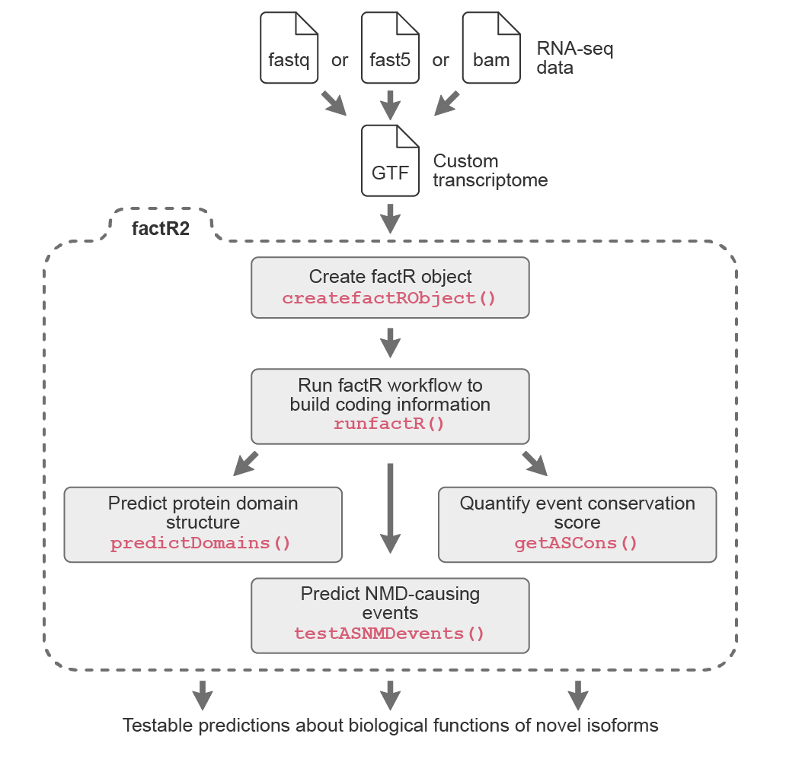

# **factR v.2**

## Functional Annotation of Custom Transcriptomes in R

## General workflow
<p align="center">
  
</p>

*factR2* is a significant upgrade of its predecessor 
[*factR*](https://fursham-h.github.io/factR/) package with user-friendly tools to work 
with custom-assembled transcriptomes. Below are *factR2*'s key features:

* Core features 
  1. Construct transcript coding (CDS) information 
  using a reference-guided process
  2. Predict protein domains on coding transcripts
  3. Predict sensitivity of coding transcripts to Nonsense-mediated decay
* Supporting features 
  1. Match chromosome levels of query GTF/object to reference annotation
  2. Match gene_id and gene_names of query GTF to reference annotation
  3. Plot transcripts from GTF GRanges object using *wiggleplotr*
  4. Subset new transcripts from custom transcriptome
  
## How to install
The development version can be installed using devtools:
```r
# install.packages("devtools")
devtools::install_github("fursham-h/factR")
```


